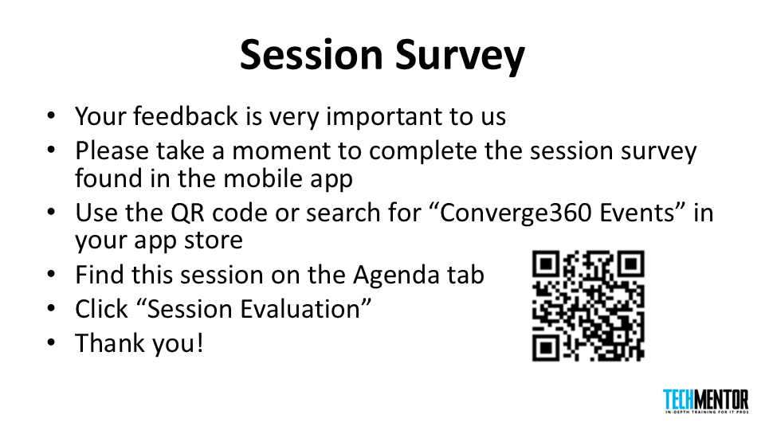
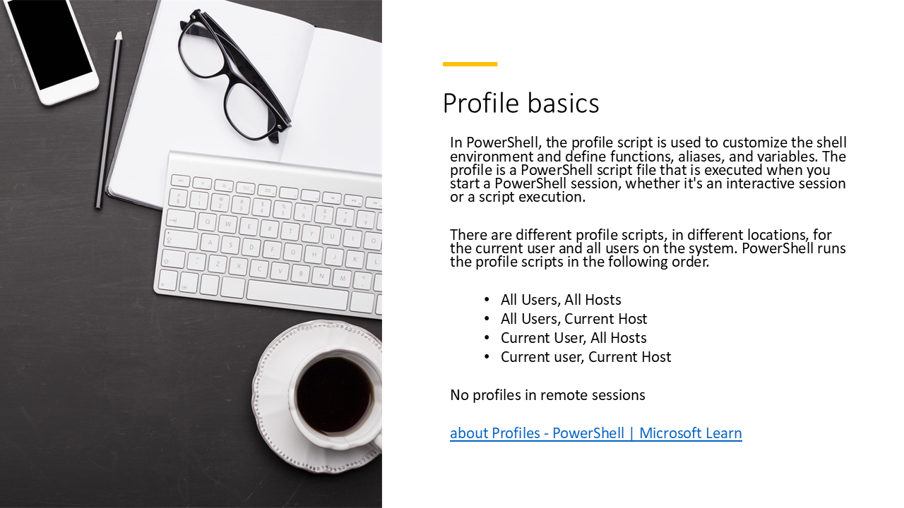
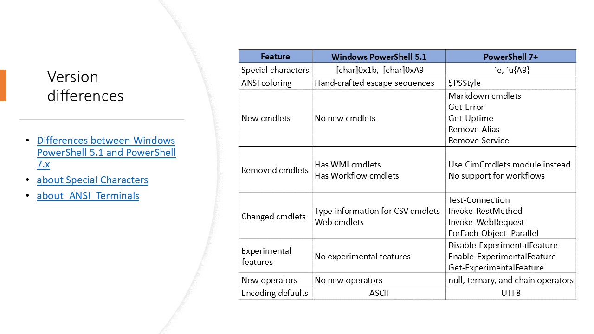
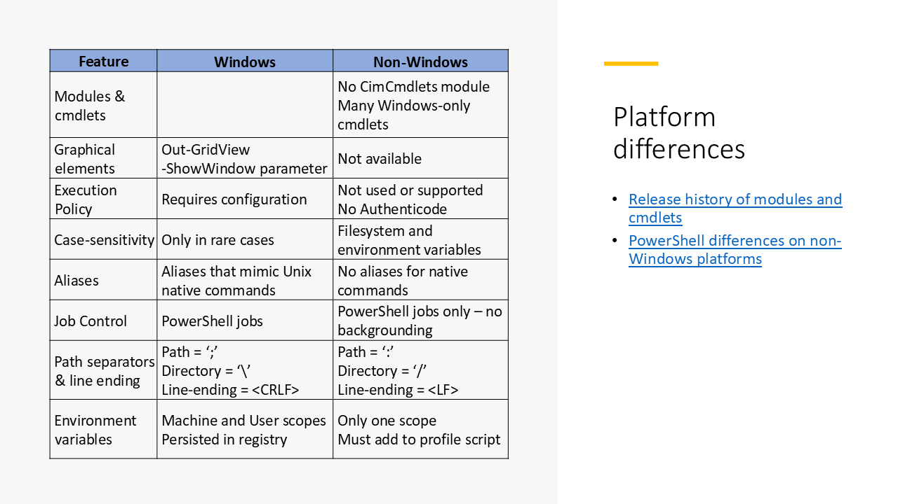
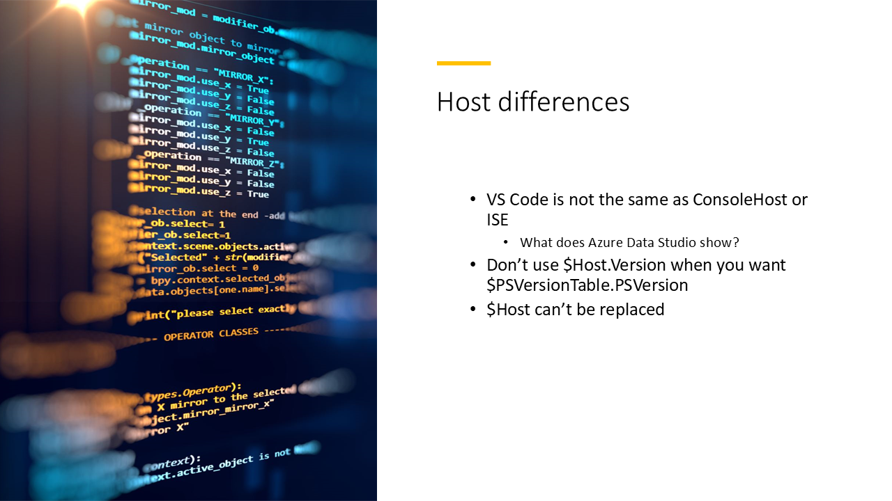
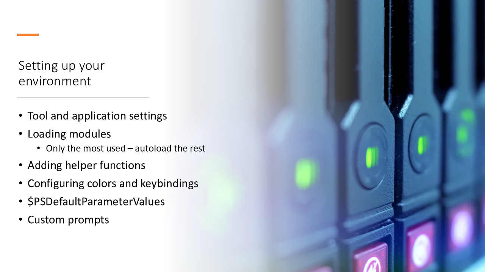
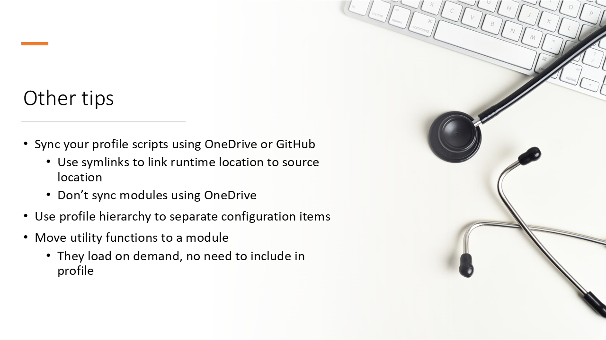

---



---

# Make your PowerShell profile work cross-platform

PowerShell runs across multiple OS platforms and multiple versions on Windows. It can be difficult
to manage your profile scripts across the different platforms and versions. Not all features are
available on all platforms or in multiple versions.

In this presentation I show you how to create a single profile script that's version and platform
aware, and configures your PowerShell environments the same across all platforms.

---

# Profile basics



In PowerShell, the profile script is used to customize the shell environment and define functions,
aliases, and variables. The profile is a PowerShell script file that's executed when you start a
PowerShell session, whether it's an interactive session or a script execution.

## Order of precedence

There are different profile scripts, in different locations, that apply to all users on the system
or just the current user. PowerShell runs the profile scripts in the following order.

- All Users, All Hosts
- All Users, Current Host
- Current User, All Hosts
- Current user, Current Host

Any settings in the profile scripts are applied in the order they are run. The last setting applied
overrides any previous settings.

The different profile scopes and locations allow you to create scripts that can be shared across
your enterprise. You can deploy scripts using group policy or configuration management tools so that
you can have a consistent PowerShell environment across all your systems.

## File locations

Use the following command to see the list of profiles scripts and locations.

```powershell
$profile | Select-Object *
```

On Windows:

```Output
AllUsersAllHosts       : C:\Program Files\PowerShell\7-preview\profile.ps1
AllUsersCurrentHost    : C:\Program Files\PowerShell\7-preview\Microsoft.PowerShell_profile.ps1
CurrentUserAllHosts    : C:\Users\sewhee\Documents\PowerShell\profile.ps1
CurrentUserCurrentHost : C:\Users\sewhee\Documents\PowerShell\Microsoft.PowerShell_profile.ps1
Length                 : 69
```

On Linux:

```Output
AllUsersAllHosts       : /opt/microsoft/powershell/7/profile.ps1
AllUsersCurrentHost    : /opt/microsoft/powershell/7/Microsoft.PowerShell_profile.ps1
CurrentUserAllHosts    : /home/sdwheeler/.config/powershell/profile.ps1
CurrentUserCurrentHost : /home/sdwheeler/.config/powershell/Microsoft.PowerShell_profile.ps1
Length                 : 67
```

PowerShell doesn't load profiles from remote sessions. If you are in a remote interactive session
you can dot-source the profile script to load it.

```powershell
. $profile
```

For more information, see [about_Profiles](https://learn.microsoft.com/powershell/module/microsoft.powershell.core/about/about_profiles).

---
# Version differences



## Differences between PowerShell 7 and Windows PowerShell 5.1

- PowerShell 7 has new character codes for Escape and any Unicode character

- PowerShell 7 has enhanced support for ANSI escape sequence handling in the console

- PowerShell 7 has several new cmdlets that aren't available in Windows PowerShell 5.1
  - `ConvertFrom-Markdown`, `Show-Markdown`
  - `Get-Error`
  - `Get-Uptime`
  - `Remove-Alias`
  - `Remove-Service`

- PowerShell 7 is missing several cmdlets that are available in Windows PowerShell 5.1
  - WMI cmdlets (Use the CimCmdlets instead)
    - `Get-WmiObject`
    - `Invoke-WmiMethod`
    - `Register-WmiEvent`
    - `Remove-WmiObject`
    - `Set-WmiInstance`
  - The Workflow cmdlets
    - `Invoke-AsWorkflow`
    - `New-PSWorkflowSession`
    - `New-PSWorkflowExecutionOption`

- The behavior of some cmdlets has changed in PowerShell 7

  For example, the `Invoke-RestMethod` cmdlet has 4 parameter sets and 58 parameters in PowerShell
  7.

  ```powershell
  PS> $PSVersionTable.PSVersion.ToString()
  7.4.5
  PS> (Get-Command Invoke-RestMethod).ParameterSets.Count
  4
  PS> (Get-Command Invoke-RestMethod).Parameters.Count
  58
  ```

  The same command in Windows PowerShell has 1 parameter set and 34 parameters.

  ```powershell
  PS> $PSVersionTable.PSVersion.ToString()
  5.1.22621.1778
  PS> (Get-Command Invoke-RestMethod).ParameterSets.Count
  1
  PS> (Get-Command Invoke-RestMethod).Parameters.Count
  34
  ```

- PowerShell 7 has new experimental features

  ```powershell
  PS>  Get-ExperimentalFeature

  Name                             Enabled Source   Description
  ----                             ------- ------   -----------
  PSCommandNotFoundSuggestion         True PSEngine Recommend potential commands based on fuzzy search on a CommandNotFo…
  PSCommandWithArgs                  False PSEngine Enable `-CommandWithArgs` parameter for pwsh
  PSFeedbackProvider                  True PSEngine Replace the hard-coded suggestion framework with the extensible feed…
  PSLoadAssemblyFromNativeCode       False PSEngine Expose an API to allow assembly loading from native code
  PSModuleAutoLoadSkipOfflineFiles    True PSEngine Module discovery will skip over files that are marked by cloud provi…
  PSSubsystemPluginModel              True PSEngine A plugin model for registering and un-registering PowerShell subsyst…
  ```

- PowerShell 7 has new operators that aren't available in Windows PowerShell 5.1

  ```powershell
  # Chain operators

  # Stop the notepad process if it's running
  Get-Process notepad && Stop-Process -Name notepad

  # Start notepad if it's not running
  Get-Process notepad || notepad

  # Ternary operator ? <if-true> : <if-false>
  (Test-Path $PROFILE) ? "Path exists" : "Path not found"
  (Test-Path $PROFILE.AllUsersAllHosts) ? "Path exists" : "Path not found"

  # Null coalesing operator ?? <if-null>
  # Return the right side value if the left side is null

  PS> $startDate = $null
  PS> $startDate ?? (Get-Date).ToShortDateString()
  8/30/2023
  PS> $startDate = '1/10/2020'
  PS> $startDate ?? (Get-Date).ToShortDateString()
  1/10/2020
  ```

- PowerShell 7 has defaults to UTF-8 encoding for all output

## Related articles

- [Differences between Windows PowerShell 5.1 and PowerShell 7.x](https://learn.microsoft.com/powershell/scripting/whats-new/differences-from-windows-powershell)
- [about Special Characters](https://learn.microsoft.com/powershell/module/microsoft.powershell.core/about/about_special_characters)
- [about_ANSI_Terminals](https://learn.microsoft.com/powershell/module/microsoft.powershell.core/about/about_ANSI_Terminals)
- [Using Experimental Features in PowerShell](https://learn.microsoft.com/powershell/scripting/learn/experimental-features)
- [about_Operators](https://learn.microsoft.com/powershell/module/microsoft.powershell.core/about/about_Operators)
- [about_Character_Encoding](https://learn.microsoft.com/powershell/module/microsoft.powershell.core/about/about_character_encoding)

---

# Platform differences



## Differences between PowerShell 7 on Windows and non-Windows platforms

- PowerShell on Windows has several modules that aren't available on non-Windows platforms

  The following modules are only available on Windows:

  - CimCmdlets
  - ISE (Windows PowerShell 5.1 only)
  - Microsoft.PowerShell.Diagnostics
  - Microsoft.PowerShell.LocalAccounts (Windows PowerShell 5.1 only)
  - Microsoft.PowerShell.ODataUtils (Windows PowerShell 5.1 only)
  - Microsoft.PowerShell.Operation.Validation (Windows PowerShell 5.1 only)
  - Microsoft.WsMan.Management
  - PSDiagnostics
  - PSScheduledJob
  - PSWorkflow (Windows PowerShell 5.1 only)
  - PSWorkflowUtility (Windows PowerShell 5.1 only)

- Non-Windows platforms don't support graphical features like `Out-GridView` and
  `Get-Help -ShowWindow`

- Non-Windows platforms don't support Authenticode or the PowerShell execution policy

- Non-Windows platforms are case-sensitive

  PowerShell is case-insensitive but case-preserving on all platforms. Non-Windows platforms are
  case-sensitive. For example, environment variables are case-sensitive on Linux.

  ```powershell
  PS> lsb_release -a
  No LSB modules are available.
  Distributor ID: Ubuntu
  Description:    Ubuntu 22.04.2 LTS
  Release:        22.04
  Codename:       jammy

  PS> Test-Path env:path
  False

  PS> Test-Path env:PATH
  True
  ```

- PowerShell on Windows has several aliases that mimic native commands on non-Windows platforms

  ```powershell
  Get-Command cat, clear, cp, diff, kill, ls, man, mount, mv, ps, rm, rmdir, sleep, sort, tee, write
  ```

  Windows:

  ```Output
  CommandType     Name                      Version    Source
  -----------     ----                      -------    ------
  Alias           cat -> Get-Content
  Alias           clear -> Clear-Host
  Alias           cp -> Copy-Item
  Alias           diff -> Compare-Object
  Alias           kill -> Stop-Process
  Alias           ls -> Get-ChildItem
  Alias           man -> help
  Alias           mount -> New-PSDrive
  Alias           mv -> Move-Item
  Alias           ps -> Get-Process
  Alias           rm -> Remove-Item
  Alias           rmdir -> Remove-Item
  Alias           sleep -> Start-Sleep
  Alias           sort -> Sort-Object
  Alias           tee -> Tee-Object
  Alias           write -> Write-Output
  ```

  Linux:

  ```Output
  CommandType     Name     Version    Source
  -----------     ----     -------    ------
  Application     cat      0.0.0.0    /usr/bin/cat
  Application     clear    0.0.0.0    /usr/bin/clear
  Application     cp       0.0.0.0    /usr/bin/cp
  Application     diff     0.0.0.0    /usr/bin/diff
  Application     kill     0.0.0.0    /usr/bin/kill
  Application     ls       0.0.0.0    /usr/bin/ls
  Application     man      0.0.0.0    /usr/bin/man
  Application     mount    0.0.0.0    /usr/bin/mount
  Application     mv       0.0.0.0    /usr/bin/mv
  Application     ps       0.0.0.0    /usr/bin/ps
  Application     rm       0.0.0.0    /usr/bin/rm
  Application     rmdir    0.0.0.0    /usr/bin/rmdir
  Application     sleep    0.0.0.0    /usr/bin/sleep
  Application     sort     0.0.0.0    /usr/bin/sort
  Application     tee      0.0.0.0    /usr/bin/tee
  Application     write    0.0.0.0    /usr/bin/write
  ```

- PowerShell doesn't support Linux-style background jobs

- PATH, directory separator, and line-ending characters are different

  - Use `[System.IO.Path]` class to handle path separators
  - Use `[System.Environment]::NewLine` to handle line-ending characters

## Related articles

- [Release history of modules and cmdlets](https://learn.microsoft.com/powershell/scripting/whats-new/cmdlet-versions)
- [PowerShell differences on non-Windows platforms](https://learn.microsoft.com/powershell/scripting/whats-new/unix-support)
- [Path Class (System.IO)](https://learn.microsoft.com/dotnet/api/system.io.path)
- [Environment.NewLine Property](https://learn.microsoft.com/dotnet/api/system.environment.newline)

---

# Host differences



- VS Code isn't the same as ConsoleHost or ISE

  Some features may not work the same. For example, the ISE doesn't support `Write-Progress`.

- Don't use `$Host.Version` when you want `$PSVersionTable.PSVersion`

  Notice the version of the Host in the PowerShell Extension terminal of VS Code.

  ```powershell
  "$($Host.Name) version = $($Host.Version)"
  "PowerShell version = $($PSVersionTable.PSVersion)"
  ```

  ```Output
  Visual Studio Code Host version = 2024.3.2
  PowerShell version = 7.4.5
  ```

- The `$Host` variable can't be replaced, so you can't use it your scripts except to get Host
  information.

---

# Setting up your environment



- Tool and application settings

  Your profile script is where you configure your environment. Use it to set configuration options
  that don't persist across sessions.

- Loading modules

  Load the modules you use the most. Let PowerShell command discovery autoload other modules on
  demand.

- Adding helper functions

  Don't define a bunch of utility functions in your profile script. Instead, create a module and put
  your functions there. Only define the functions needed to bootstrap your environment in your
  profile script.

- Configuring colors and keybindings

  PowerShell 7.2 added a new automatic variable, `$PSStyle`, and changes to the PowerShell engine to
  support the output of ANSI-decorated text. For Windows PowerShell, you can use the **PSStyle**
  module to achieve similar results. Also, the **PSReadLine** allows you to configure colors for
  syntax highlighting on the command line.

  **PSReadLine** also lets you customize keybindings. For example, you can map the keybinding for
  `<Enter>` to the `ValidateAndAcceptLine` function. This function prevents you from running
  a command with syntax errors.

  Add these commands to your profile so they persist across sessions.

- Default parameter values

  The `$PSDefaultParameterValues` preference variable allows you to set default parameter values for
  cmdlets. For example, you may want the `Install-Module` to alway use the **SkipPublisherCheck**
  parameter.

  Here are several examples:

  ```powershell
  $PSDefaultParameterValues = @{
      'Out-Default:OutVariable'           = 'LastResult'  # Save output to $LastResult
      'Out-File:Encoding'                 = 'utf8'        # PS5.1 defaults to ASCII
      'Export-Csv:NoTypeInformation'      = $true         # PS5.1 defaults to $false
      'ConvertTo-Csv:NoTypeInformation'   = $true         # PS5.1 defaults to $false
      'Receive-Job:Keep'                  = $true         # Prevents accidental loss of output
      # 'Group-Object:NoElement'          = $true         # Minimize noise in output
      'Install-Module:AllowClobber'       = $true         # Default behavior in Install-PSResource
      'Install-Module:Force'              = $true         # Default behavior in Install-PSResource
      'Install-Module:SkipPublisherCheck' = $true         # Default behavior in Install-PSResource
      'Find-Module:Repository'            = 'PSGallery'   # Useful if you have private test repos
      'Install-Module:Repository'         = 'PSGallery'   # Useful if you have private test repos
      'Find-PSResource:Repository'        = 'PSGallery'   # Useful if you have private test repos
      'Install-PSResource:Repository'     = 'PSGallery'   # Useful if you have private test repos
  }
  ```

- Custom prompts

  The prompt that PowerShell displays is created by the `prompt` function. You can write your own
  custom `prompt` function to display whatever you want.

## Related articles

- [about_Prompts](https://learn.microsoft.com/powershell/module/microsoft.powershell.core/about/about_prompts)
- [about_Parameters_Default_Values](https://learn.microsoft.com/powershell/module/microsoft.powershell.core/about/about_parameters_default_values)
- [Set-PSReadLineOption](https://learn.microsoft.com/powershell/module/psreadline/set-psreadlineoption)
- [PSStyle module](https://www.powershellgallery.com/packages/PSStyle)

---

# Other tips



- Sync your profile scripts using a OneDrive folder or a GitHub repository.

  You can use symlinks to link the runtime location to source location.

  You can use a script to create the symlink.

  ```powershell
  # Creating the symbolic link to the profile
  $newItemSplat = @{
      ItemType = 'SymbolicLink'
      Value = 'C:\Git\My-Repos\tools-by-sean\profile\scripts\CurrentUserAllHosts.ps1'
      Path = $PROFILE.CurrentUserAllHosts
  }
  New-Item @newItemSplat
  ```

  However, be careful using OneDrive. OneDrive won't sync symlinks. Don't let OneDrive redirect your
  `Documents` folder on Windows. This causes problems with the command discovery and module loading.

- Use the profile hierarchy to separate configuration items.

  Put the configurations that are most common in the `$PROFILE.CurrentUserAllHosts` profile or
  higher. Put configurations that are specific to a host in the `$PROFILE.CurrentUserCurrentHost`
  profile.

- Move utility functions out of your profile and into a module.

  The modules get loaded on demand. There is no need to include them in your profile.

- Don't pollute your environment with a bunch of variables in your profile.

  - Wrap code in functions or script blocks to limit the scope of variables.
  - Use the `$global:` scope to create and manage the variables you want to be available everywhere.

---

# Resources & links

Modules

- [PSStyle][10]
- [CompletionPredictor][08]
- [Microsoft.PowerShell.UnixTabCompletion][09]

Docs

- [about_Profiles][03]
- [Differences between Windows PowerShell 5.1 and PowerShell 7.x][06]
- [about_Special_Characters][04]
- [about_ANSI_Terminals][01]
- [Release history of modules and cmdlets][05]
- [PowerShell differences on non-Windows platforms][07]
- [about_Operators][02]

Demo scripts

- [demo.ps1][11] - Script used to demonstrate the version and platform differences in PowerShell
- [Microsoft.PowerShell_profile.ps1][12] - Sample profile script showing how to manage the version
  and platform differences
- [Microsoft.VSCode_profile.ps1][13] - Sample profile script that gets run by the PowerShell
  extension for VS Code

<!-- link references -->
[01]: https://learn.microsoft.com/powershell/module/microsoft.powershell.core/about/about_ansi_terminals
[02]: https://learn.microsoft.com/powershell/module/microsoft.powershell.core/about/about_operators
[03]: https://learn.microsoft.com/powershell/module/microsoft.powershell.core/about/about_profiles
[04]: https://learn.microsoft.com/powershell/module/microsoft.powershell.core/about/about_special_characters
[05]: https://learn.microsoft.com/powershell/scripting/whats-new/cmdlet-versions
[06]: https://learn.microsoft.com/powershell/scripting/whats-new/differences-from-windows-powershell
[07]: https://learn.microsoft.com/powershell/scripting/whats-new/unix-support
[08]: https://www.powershellgallery.com/packages/CompletionPredictor/
[09]: https://www.powershellgallery.com/packages/Microsoft.PowerShell.UnixTabCompletion/
[10]: https://www.powershellgallery.com/packages/PSStyle/
[11]: https://github.com/sdwheeler/seanonit/blob/main/content/downloads/psprofiles/demo.ps1
[12]: https://github.com/sdwheeler/seanonit/blob/main/content/downloads/psprofiles/Microsoft.PowerShell_profile.ps1
[13]: https://github.com/sdwheeler/seanonit/blob/main/content/downloads/psprofiles/Microsoft.VSCode_profile.ps1
