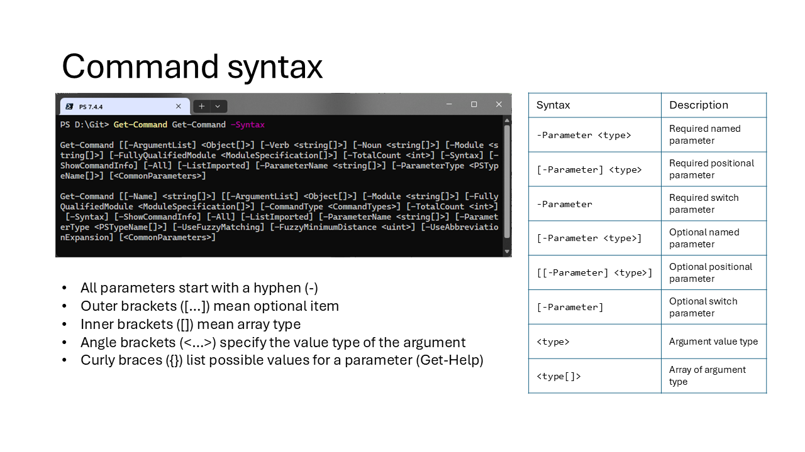
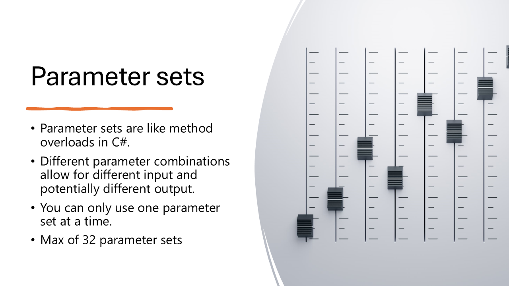
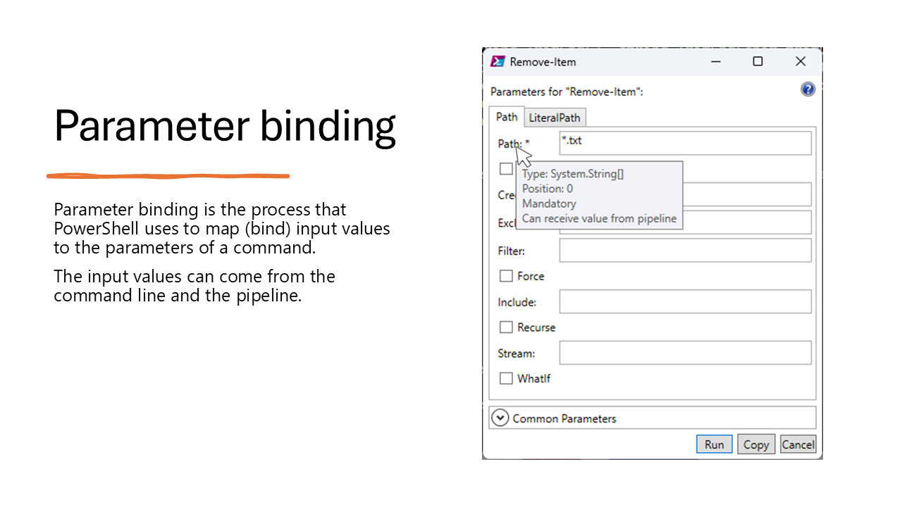
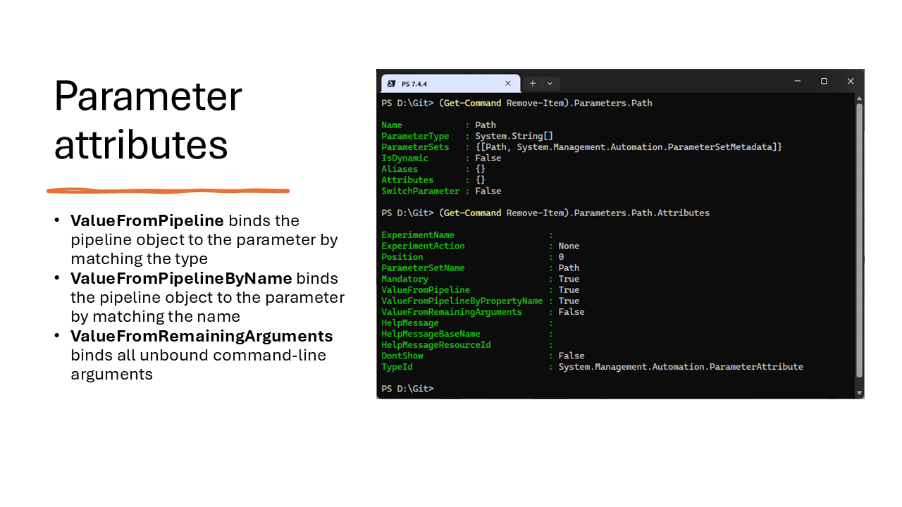
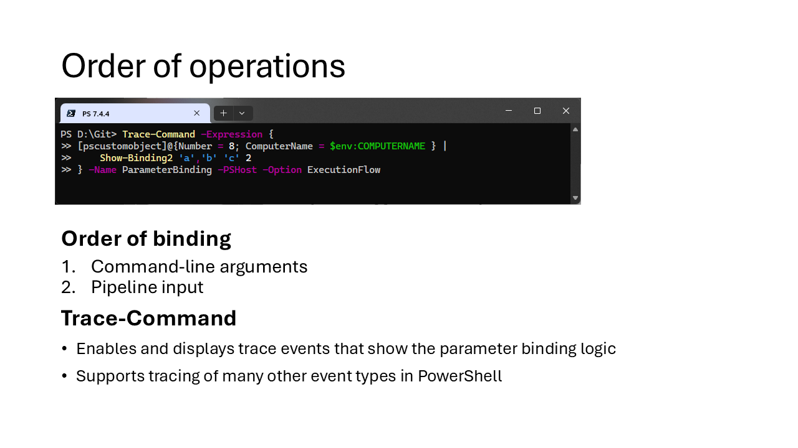
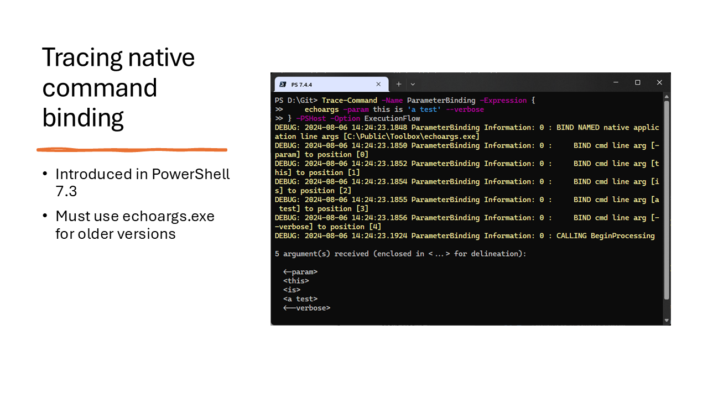

# Understanding & Troubleshooting PowerShell Parameter Binding


Parameter binding is the process that PowerShell uses to determine which parameter set is being used
and to associate (bind) values to the parameters of a command. These values can come from the
command line and the pipeline.

This presentation covers the following topics:

- How to interpret command syntax
- The purpose of parameter sets
- The parameter binding process
- The role of parameter attributes
- How to troubleshoot parameter binding issues
- How parameter binding works for native commands

---
# Command syntax



Before you can understand how parameter binding works, you need to understand how to interpret
command syntax.The `Get-Help` and `Get-Command` cmdlets display syntax diagrams to help you
use commands correctly.

```powershell
Get-Help Get-Command
```

```Output
NAME
    Get-Command

SYNOPSIS
    Gets all commands.

SYNTAX
    Get-Command [[-Name] <System.String[]>] [[-ArgumentList] <System.Object[]>] [-All]
    [-CommandType {Alias | Function | Filter | Cmdlet | ExternalScript | Application |
    Script | Workflow | Configuration | All}] [-FullyQualifiedModule
    <Microsoft.PowerShell.Commands.ModuleSpecification[]>] [-ListImported] [-Module
    <System.String[]>] [-ParameterName <System.String[]>] [-ParameterType
    <System.Management.Automation.PSTypeName[]>] [-ShowCommandInfo] [-Syntax]
    [-TotalCount <System.Int32>] [-UseAbbreviationExpansion] [-UseFuzzyMatching]
    [<CommonParameters>]

    Get-Command [[-ArgumentList] <System.Object[]>] [-All] [-FullyQualifiedModule
    <Microsoft.PowerShell.Commands.ModuleSpecification[]>] [-ListImported] [-Module
    <System.String[]>] [-Noun <System.String[]>] [-ParameterName <System.String[]>]
    [-ParameterType <System.Management.Automation.PSTypeName[]>] [-ShowCommandInfo]
    [-Syntax] [-TotalCount <System.Int32>] [-Verb <System.String[]>] [<CommonParameters>]
```

Notice the differences between the output from the two commands. `Get-Help` displays show full type
names, while `Get-Command` shows only short type names. The `Get-Help` output also shows possible
values for some parameters.

```powershell
Get-Command Get-Command -Syntax
```

```Output
Get-Command [[-ArgumentList] <Object[]>] [-Verb <string[]>] [-Noun <string[]>]
[-Module <string[]>] [-FullyQualifiedModule <ModuleSpecification[]>]
[-TotalCount <int>] [-Syntax] [-ShowCommandInfo] [-All] [-ListImported]
[-ParameterName <string[]>] [-ParameterType <PSTypeName[]>]
[<CommonParameters>]

Get-Command [[-Name] <string[]>] [[-ArgumentList] <Object[]>]
[-Module <string[]>] [-FullyQualifiedModule <ModuleSpecification[]>]
[-CommandType <CommandTypes>] [-TotalCount <int>] [-Syntax] [-ShowCommandInfo]
[-All] [-ListImported] [-ParameterName <string[]>]
[-ParameterType <PSTypeName[]>] [-UseFuzzyMatching]
[-FuzzyMinimumDistance <uint>] [-UseAbbreviationExpansion]
[<CommonParameters>]
```

## Symbols in Syntax Diagrams

The syntax diagram lists the command name, the command parameters, and the parameter values.

The syntax diagrams use the following symbols:

- A hyphen `-` indicates a parameter name. In a command, type the hyphen immediately before the
  parameter name with no intervening spaces, as shown in the syntax diagram.

<!-- `< >` - also known as chi-hua-huas -->
- Angle brackets `< >` indicate placeholder text. You don't type the angle brackets or the
  placeholder text in a command. Instead, you replace it with the item that it describes.

  The placeholder inside the angle brackets identifies the .NET type of the value that a parameter
  takes. For example, to use the **Name** parameter of `Get-Command`, replace the `<string[]>` with
  one or more strings separated by commas (`,`).

<!-- `[]` - also known as binkies -->
- Brackets `[]` inside of the angle brackets indicate that the parameter can accept one or more
  values of that type. Enter the values as a comma-separated list.

- Parameters with no values

  Some parameters don't accept input, so they don't have a parameter value. Parameters without
  values are _switch parameters_. Switch parameters are used like boolean values. They default to
  `$false`. When you use a switch parameter, the value is set to `$true`.

<!-- So what are these `[    ]`? - square brackets, duh! -->
- Brackets `[  ]` around parameters indicate optional items. A parameter and its value can be
  optional. For example, the **CommandType** parameter of `Get-Command` and its value are enclosed
  in brackets because they're both optional.

- Braces `{}` indicate an _enumeration_, which is a set of valid values for a parameter.

  The values in the braces are separated by vertical bars `|`. These bars indicate an _exclusive-OR_
  choice, meaning that you can choose only one value from the set of values that are listed inside
  the braces. For example, the **CommandType** parameter of `Get-Command` has a list of possible
  values in braces.

## Related links

- [about_Command_Syntax](https://learn.microsoft.com/powershell/module/microsoft.powershell.core/about/about_command_syntax)
- [Get-Command](https://learn.microsoft.com/powershell/module/microsoft.powershell.core/get-command)
- [Get-Help](https://learn.microsoft.com/powershell/module/microsoft.powershell.core/get-help)

---

# Parameter sets



PowerShell uses parameter sets to allow a single command to accept varied input and, potentially,
produce different output based on the input. Parameter sets are similar to function overloading in
other programming languages, like C#.

## Parameter set requirements

- There is a limit of 32 parameter sets.
- Each parameter set must have at least one unique parameter. If possible, make this parameter a
  mandatory parameter. However, the unique parameter can't be mandatory if the cmdlet is designed to
  run without any parameters.
- A parameter set that contains multiple positional parameters must define unique positions for each
  parameter. No two positional parameters can specify the same position.
- Only one parameter in a set can have the **ValueFromPipeline** attribute. Multiple parameters can
  have the **ValueFromPipelineByPropertyName** attribute.
- If no parameter set is specified for a parameter, the parameter belongs to all parameter sets.

### Default parameter set

The PowerShell runtime uses the unique parameter to determine which parameter set is being used.
PowerShell uses the default parameter set if it can't determine the parameter set to use based on
the information provided by the command. The default parameter set is defined by setting the
`DefaultParameterSetName` property of the `[CmdletBinding()]` attribute. You can avoid the need to
define a default by making the unique parameter of each parameter set a mandatory parameter.

## Related links

- [about_Parameter_Sets](https://learn.microsoft.com/powershell/module/microsoft.powershell.core/about/about_parameter_sets)

---

# Parameter binding



Parameter binding is the process that PowerShell uses to associate (bind) input values to the
parameters of a command. The input values can come from the command line and the pipeline.

It's like filling in the blanks in a form, like the one shown in the slide. On Windows (only), the
`Show-Command` cmdlet presents a form that you can use to fill in parameter values. The form shows a
tab for each parameter set. If fill in the form and select **Run**, PowerShell runs the command with
the values you provided. If you select **Copy**, PowerShell copies the command to the clipboard. You
can then paste the command into a script or the console.

## Related links

- [about_Parameter_Binding](https://learn.microsoft.com/powershell/module/microsoft.powershell.core/about/about_parameter_binding)
- [Show-Command](https://learn.microsoft.com/powershell/module/microsoft.powershell.utility/show-command)

---

# Parameter attributes



The `Get-Help` command tells you if a parameter accepts pipeline input or from remaining arguments.
You can also use `Get-Command` to inspect the attributes of a parameter.

First, let's look at the properties of the **Path** parameter of the **Remove-Item** command.

```powershell
(Get-Command Remove-Item).Parameters['Path']
```

From the output, you can see that the parameter belongs to the **Path** parameter set, accepts one
or more strings, and doesn't have any aliases.

```Output
Name            : Path
ParameterType   : System.String[]
ParameterSets   : {[Path, System.Management.Automation.ParameterSetMetadata]}
IsDynamic       : False
Aliases         : {}
Attributes      : {Path}
SwitchParameter : False
```

By inspecting the **Attributes** property, you can see that the **Path** parameter is mandatory and
accepts values from the pipeline by value or property name.

```powershell
(Get-Command Remove-Item).Parameters['Path'].Attributes
```

```Output
Position                        : 0
ParameterSetName                : Path
Mandatory                       : True
ValueFromPipeline               : True
ValueFromPipelineByPropertyName : True
ValueFromRemainingArguments     : False
HelpMessage                     :
HelpMessageBaseName             :
HelpMessageResourceId           :
DontShow                        : False
TypeId                          : System.Management.Automation.ParameterAttribute
```

Next, let's compare that to the **LiteralPath** parameter. This parameter belongs to the
**LiteralPath** parameter set, accepts one or more strings, and has an alias of **PSPath**.

```powershell
(Get-Command Remove-Item).Parameters['LiteralPath']
```

```Output
Name            : LiteralPath
ParameterType   : System.String[]
ParameterSets   : {[LiteralPath, System.Management.Automation.ParameterSetMetadata]}
IsDynamic       : False
Aliases         : {PSPath}
Attributes      : {LiteralPath, System.Management.Automation.AliasAttribute}
SwitchParameter : False
```

By inspecting the **Attributes** property, you can see that the **LiteralPath** parameter is
mandatory and accepts values from the pipeline by property name.

```powershell
(Get-Command Remove-Item).Parameters['LiteralPath'].Attributes
```

```Output
Position                        : -2147483648
ParameterSetName                : LiteralPath
Mandatory                       : True
ValueFromPipeline               : False
ValueFromPipelineByPropertyName : True
ValueFromRemainingArguments     : False
HelpMessage                     :
HelpMessageBaseName             :
HelpMessageResourceId           :
DontShow                        : False
TypeId                          : System.Management.Automation.ParameterAttribute

AliasNames : {PSPath}
TypeId     : System.Management.Automation.AliasAttribute
```

## Related links

- [about_Functions_Advanced_Parameters](https://learn.microsoft.com/powershell/module/microsoft.powershell.core/about/about_functions_advanced_parameters#attributes-of-parameters)

---

# Order of operations



## Binding order

First, PowerShell binds command-line arguments in the following order:

1. Named parameters
1. Positional parameters
1. **ValueFromRemainingArguments** parameters

After command-line arguments, PowerShell tries to bind pipeline input:

1. Match values by type to parameters that use **ValueFromPipeline**
1. Match values by name to parameters that use **ValueFromPipelineByPropertyName**

After binding all input, PowerShell calls the command with the bound parameters. The command outputs
an error if it can't determine which parameter set is being used.

## $PSBoundParameters

This automatic variable contains a dictionary of the parameters and the values that were bound to
them. The parameter names are the keys, and the argument values are the values. If a parameter
wasn't bound, it isn't in the dictionary.

This variable has a value only in a scope where parameters are declared, such as a script or
function. You can use it to determine which parameters were bound, display or change the values that
were bound, and to pass parameter values to another script or function.

## Trace-Command

`Trace-Command` is a great troubleshooting tool that helps you understand how PowerShell works
internally. Use the `Get-TraceSource` command to see the available trace providers.

- Enables and displays trace events for a single scriptblock
- You can trace the following events from any of the 36 providers
  - ExecutionFlow: Constructor, Dispose, Finalizer, Method, Delegates, Events, Scope
  - Data: Constructor, Dispose, Finalizer, Property, Verbose, WriteLine
  - Errors: Error, Exception

## Demo

In the [demo script](https://github.com/sdwheeler/seanonit/blob/main/content/downloads/binding/binding.ps1), I show you how to use `Trace-Command` to see the parameter binding process
in action and compare the trace information to the results in `$PSBoundParameters`.

## Related links

- [Trace-Command](https://learn.microsoft.com/powershell/module/microsoft.powershell.utility/trace-command)
- [Get-TraceSource](https://learn.microsoft.com/powershell/module/microsoft.powershell.utility/get-tracesource)
- [Visualize parameter binding](https://learn.microsoft.com/powershell/scripting/learn/deep-dives/visualize-parameter-binding)

---

# Tracing native command binding



Starting in PowerShell 7.3, you can trace the binding of native commands. This feature is useful for
troubleshooting issues with passing parameters native commands in PowerShell. There is no standard
format for passing arguments to native commands. Each command-line tool has its own rules for
parsing parameters and arguments. The way the PowerShell parses the command line is different from
version to version and platform to platform.

The rules for parsing, quoting strings, and escaping characters are complex. For more information,
see:

- [about_Parsing](https://learn.microsoft.com/powershell/module/microsoft.powershell.core/about/about_parsing)
- [about_Quoting_Rules](https://learn.microsoft.com/powershell/module/microsoft.powershell.core/about/about_quoting_rules)
- [about_Special_Characters](https://learn.microsoft.com/powershell/module/microsoft.powershell.core/about/about_special_characters)

The output from `Trace-Command` shows how PowerShell parses the command-line arguments for a native
command.

## Parsing command-line arguments for native commands

Older versions of PowerShell you have to use a tool like `echoargs.exe` to see how PowerShell passes
arguments to native commands. You can use the [make-echoargs.ps1](https://github.com/sdwheeler/seanonit/blob/main/content/downloads/binding/make-echoargs.ps1) script to create the
`echoargs.exe` tool for Windows.

The following examples shows the output from `Trace-Command` followed by the output from `echoargs`.


```powershell
Trace-Command -Name ParameterBinding -Expression {
    echoargs -param this is 'a test' --verbose
} -PSHost -Option ExecutionFlow
```

```Output
DEBUG: 2024-08-09 15:14:09.3088 ParameterBinding Information: 0 : BIND NAMED native application line args [C:\Public\Toolbox\echoargs.exe]
DEBUG: 2024-08-09 15:14:09.3098 ParameterBinding Information: 0 :     BIND cmd line arg [-param] to position [0]
DEBUG: 2024-08-09 15:14:09.3100 ParameterBinding Information: 0 :     BIND cmd line arg [this] to position [1]
DEBUG: 2024-08-09 15:14:09.3102 ParameterBinding Information: 0 :     BIND cmd line arg [is] to position [2]
DEBUG: 2024-08-09 15:14:09.3104 ParameterBinding Information: 0 :     BIND cmd line arg [a test] to position [3]
DEBUG: 2024-08-09 15:14:09.3105 ParameterBinding Information: 0 :     BIND cmd line arg [--verbose] to position [4]
DEBUG: 2024-08-09 15:14:09.3177 ParameterBinding Information: 0 : CALLING BeginProcessing

5 argument(s) received (enclosed in <...> for delineation):

  <-param>
  <this>
  <is>
  <a test>
  <--verbose>
```

---

# Summary

Understanding how PowerShell binds parameters is essential to writing effective scripts and
functions or troubleshooting pipeline data problems. The binding process is complex, but it's also
predictable. By understanding the rules, you can write commands that are easier to use and more
reliable.

## Tools

- [Script to create echoargs][02]
- [Demo script used in this presentation][01]

## Documentation

- [about_Command_Syntax][03]
- [about_Functions_Advanced_Parameters][04]
- [about_Parameter_Binding][05]
- [about_Parameter_Sets][06]
- [about_Parsing][07]
- [about_Quoting_Rules][08]
- [about_Special_Characters][09]
- [Get-Command][10]
- [Get-Help][11]
- [Get-TraceSource][12]
- [Trace-Command][13]
- [Visualize parameter binding][14]

<!-- link references -->
[01]: https://github.com/sdwheeler/seanonit/blob/main/content/downloads/binding/binding.ps1
[02]: https://github.com/sdwheeler/seanonit/blob/main/content/downloads/binding/make-echoargs.ps1
[03]: https://learn.microsoft.com/powershell/module/microsoft.powershell.core/about/about_command_syntax
[04]: https://learn.microsoft.com/powershell/module/microsoft.powershell.core/about/about_functions_advanced_parameters#attributes-of-parameters
[05]: https://learn.microsoft.com/powershell/module/microsoft.powershell.core/about/about_parameter_binding
[06]: https://learn.microsoft.com/powershell/module/microsoft.powershell.core/about/about_parameter_sets
[07]: https://learn.microsoft.com/powershell/module/microsoft.powershell.core/about/about_parsing
[08]: https://learn.microsoft.com/powershell/module/microsoft.powershell.core/about/about_quoting_rules
[09]: https://learn.microsoft.com/powershell/module/microsoft.powershell.core/about/about_special_characters
[10]: https://learn.microsoft.com/powershell/module/microsoft.powershell.core/get-command
[11]: https://learn.microsoft.com/powershell/module/microsoft.powershell.core/get-help
[12]: https://learn.microsoft.com/powershell/module/microsoft.powershell.utility/get-tracesource
[13]: https://learn.microsoft.com/powershell/module/microsoft.powershell.utility/trace-command
[14]: https://learn.microsoft.com/powershell/scripting/learn/deep-dives/visualize-parameter-binding
